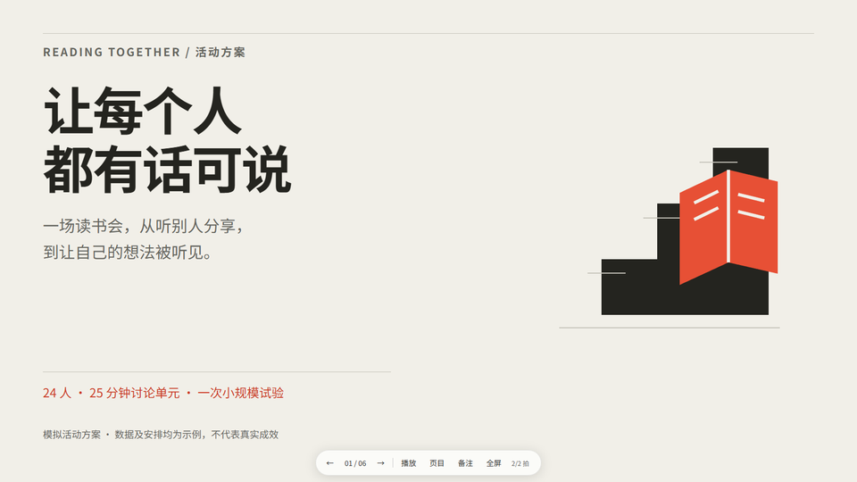

# Design Deck Skill

**把主题、文档或数据做成有设计感的 HTML PPT，在浏览器里直接改字、换图，并导出文字可编辑的 PowerPoint。**

一个可分享的 Agent Skill：用内容确认和视觉参考驱动制作，附三套 DESIGN.md、可视选款页、通用播放器与独立编辑器。



## 能做什么

- 先确认页数和 ASCII 逐页标题、必现文字，再进入视觉制作。
- 参考 Refero 与优秀作品，先形成项目 DESIGN.md 初稿，再搜集匹配素材、制作代表页，更新定版规范后完成全稿。
- 三套起步风格：趣味立体、商业情报、建筑编辑；支持扩展自己的设计方向。
- 浏览器演示：分拍、回退、页目、备注、自动播放、全屏与减少动态效果。
- 直接编辑文字，替换照片、调裁切，支持撤销重做；保存或下载单文件 HTML。
- 导出真正的 `.pptx`：文字是原生文本框，照片、渐变和装饰合成背景。动画保留在 HTML。

## 安装与使用

下载本仓库 ZIP，解压后将文件夹命名为 `design-deck`，放入你的 AI 工具支持的 Skills 目录。根部 `SKILL.md` 是入口；自动发现方式由宿主工具决定。

也可克隆：

```bash
git clone https://github.com/Lonc2100/design-deck-skill.git design-deck
```

对支持本地文件读取的助手说：

> 读取 design-deck/SKILL.md。把我的材料做成 HTML 演示稿。先让我确认总页数及 ASCII 逐页标题、全部必现文字，再寻找视觉参考与素材。交付可直接编辑的 HTML，另附文字可编辑的 PPTX。

继续已有可编辑稿时，把**最新保存的 HTML**或下载的修改记录交给助手。用户手改状态优先于旧 outline.md。

## 先看样例

下载到本地后打开 [风格选款页](gallery/index.html)，再查看三套完整样例：

| 风格 | 完整播放 | 设计规范 |
| --- | --- | --- |
| 趣味立体 | [六页样例](examples/playful/index.html) | [DESIGN.md](designs/playful/DESIGN.md) |
| 商业情报 | [六页样例](examples/commerce-intelligence/index.html) | [DESIGN.md](designs/commerce-intelligence/DESIGN.md) |
| 建筑编辑 | [六页样例](examples/reading-circle/index.html) | [DESIGN.md](designs/project-journal/DESIGN.md) |

GitHub 文件页面不执行 HTML，请下载后在浏览器打开。样例是模拟读书会方案，用于展示功能与风格。

## 生成可编辑版本

初始化需要 Python 3.10+；生成可编辑单文件另需 `beautifulsoup4`：

```bash
python -m pip install -r requirements.txt
python scripts/init_deck.py "my-deck" --style project-journal --title "我的演示"
```

初始化稿含待填内容。按 Skill 完成内容确认、参考研究、素材与设计后，再生成新版本：

```bash
python scripts/check_deck.py "my-deck"
python scripts/enable_editor.py "my-deck" "my-deck-editable"
python scripts/check_deck.py "my-deck-editable"
```

打开输出中的 `index.html`，点击底部 **编辑 / 导出**。播放、编辑、下载和 PPTX 导出均可离线运行。浏览器草稿不等于原文件：请保存或下载 HTML；需要自动回写时运行附带的 `serve_editor.py`，只在本机监听。

## 当前边界与验证

当前版本：**0.2.0**。已做本地静态、离线播放、编辑保存与 PPTX 文件结构检查，详情见 [编辑器验证](reports/editor-validation.md)。尚未做独立新用户试用、跨系统验证或 PowerPoint/WPS 实际渲染验证。

PPTX 文字可编辑，背景中的照片、图形与图表不能逐对象编辑。字体缺失、复杂 CSS 或 SVG 可能影响显示，详见 [编辑与导出](references/editing.md)。不承诺自动获得特定设计效果。

原始制作流程、设计规范与质量检查分别见 [SKILL.md](SKILL.md)、[DESIGN.md 契约](references/design-contract.md)、[质量检查](references/quality.md)。历史记录保留其原有版本和验证范围。

## 许可

原创代码与模板采用 [MIT](LICENSE)。PptxGenJS、html2canvas 及 JSZip 的许可保留在 [vendor](templates/vendor/)；JSZip 选择 MIT 许可。未使用 Dashi 的 AGPL 编辑器源码或专有导出引擎。外部素材需按其来源许可处理。
